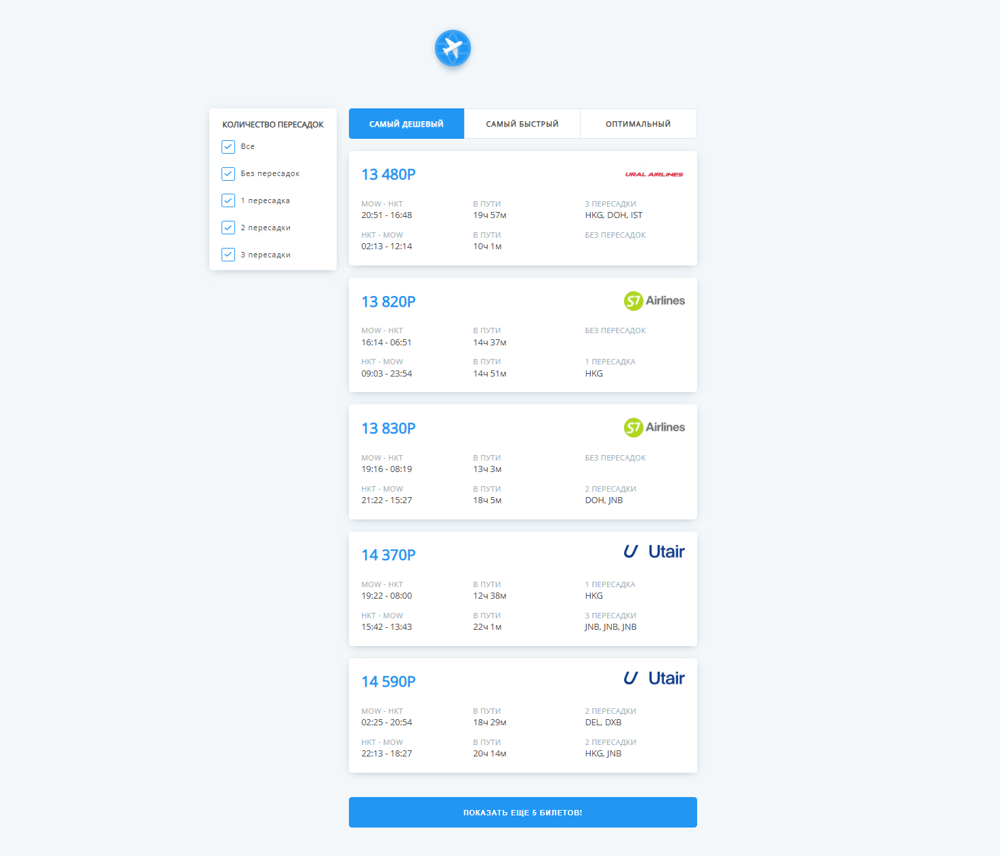
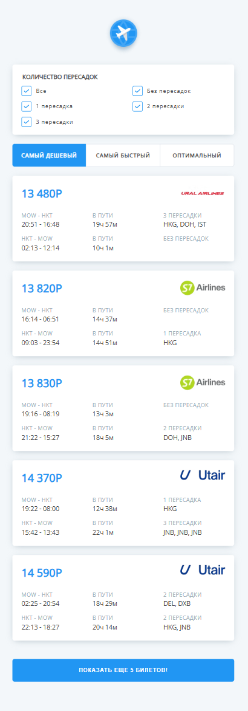

# Aviasale

Frontend application for searching and filtering flight tickets.

## Features
- Flight search UI
- API requests
- Filters
- Sorting
- Responsive design
- Error handling
- Loading states
- Empty states

## Tech Stack
- React
- TypeScript
- Redux Toolkit
- REST API
- Axios
- SCSS
- Vite

## Demo
Live Demo: https://aviasales-murex-six.vercel.app/

## Screenshots

### Desktop


### Mobile


## Installation

```bash
npm install
npm run dev
```

## Author
Kseniia Suvorova
